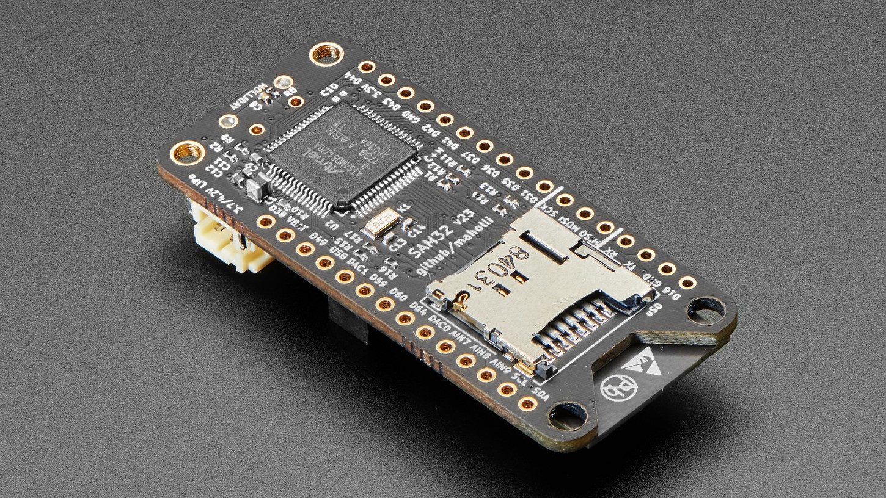
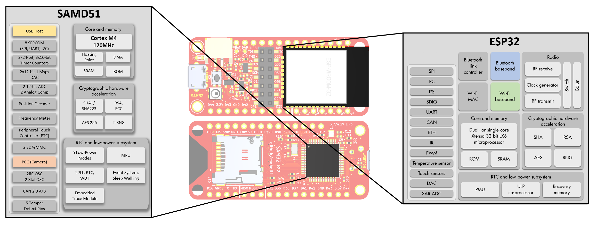

# SAM32

  
    
  

You can control this board with python or arduino! A basic text-editor is all you need to get started.

## [⭐ See the SAM32 Guide for tutorials, design resources, and more!](https://www.notion.so/maholli/SAM32-Guides-6b7e8ca318ff49418eec16e975d98f5d)
    
### Easily Add Hardware Capability

Compatibility with [Adafruit Feather Wings](https://www.adafruit.com/category/814) makes adding sound, displays, and even GPS a breeze for the SAM32.

  

### Want to Help Out?

visit https://github.com/maholli/SAM32/projects/1 for a current list of software tasks in need of YOUR help! :point_left:

    

#### Thank you Adafruit for the time/money spent developing CircuitPython! (and for the beautiful photos of the SAM32)

